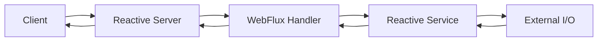

Spring WebFlux는 "MVC보다 빠른 프레임워크"라기보다, 요청 처리 모델을 동기 블로킹에서 비동기 논블로킹으로 바꾸는 선택지에 가깝다. Spring Framework 문서 기준으로 WebFlux는 Spring 5.0에서 추가된 reactive-stack 웹 프레임워크이며, 완전한 논블로킹 처리와 Reactive Streams backpressure를 지원한다. Spring Boot 문서도 WebFlux가 Servlet API에 의존하지 않고 Reactor를 통해 Reactive Streams를 구현한다고 설명한다.

따라서 WebFlux 선택의 핵심 질문은 "트래픽이 많은가"가 아니라 "요청 처리 중 대기 시간이 많은가"에 있다. 외부 API 호출, 메시지 브로커 연동, 스트리밍 응답, SSE, WebSocket, 긴 폴링, 비동기 I/O가 많은 서비스라면 적은 스레드로 많은 동시 연결을 유지하는 WebFlux 모델이 의미가 있다. 반대로 대부분의 작업이 짧은 DB 트랜잭션과 CPU 연산이고, 사용하는 라이브러리도 JDBC처럼 블로킹 중심이라면 MVC가 더 단순하고 예측 가능하다.



WebFlux에서 중요한 것은 체인 중간을 블로킹 호출로 막지 않는 것이다. 컨트롤러 반환 타입이 `Mono`나 `Flux`라고 해서 전체 서비스가 자동으로 논블로킹이 되는 것은 아니다. 내부에서 블로킹 JDBC, 파일 I/O, 오래 걸리는 동기 SDK를 그대로 호출하면 이벤트 루프 스레드를 붙잡아 장점을 잃는다. 이 경우에는 블로킹 작업을 별도 스케줄러로 격리하거나, 애초에 MVC와 명시적인 스레드 풀 모델을 선택하는 편이 더 나을 수 있다.

```kotlin
// 개념 예시: 외부 API 호출과 저장을 논블로킹 체인으로 연결하는 흐름
fun createOrder(command: OrderCommand): Mono<OrderResult> {
    return validate(command)
        .flatMap { validCommand -> pricingClient.quote(validCommand.items) }
        .flatMap { quote -> orderRepository.save(command.toOrder(quote)) }
        .map { saved -> OrderResult(saved.id, saved.status) }
        .timeout(Duration.ofSeconds(2))
}
```

운영 관점에서는 timeout, retry, backpressure, 관측 가능성을 함께 봐야 한다. WebFlux 서비스는 하나의 요청이 여러 비동기 경계를 지나가기 때문에 로그 MDC, trace context, 에러 전파 방식이 MVC보다 복잡해질 수 있다. 또한 팀이 Reactor 연산자와 scheduler 모델에 익숙하지 않으면 단순한 로직도 디버깅 비용이 커진다.

정리하면 WebFlux는 "모든 백엔드의 기본값"이 아니라, 논블로킹 I/O와 스트리밍 응답이 서비스의 핵심일 때 효과적인 선택이다. Spring MVC는 여전히 대부분의 CRUD API에서 좋은 기본값이고, WebClient만 MVC 애플리케이션에 함께 쓰는 조합도 가능하다. 좋은 판단 기준은 프레임워크 선호가 아니라 호출 그래프다. 요청 하나가 어떤 외부 시스템을 기다리는지, 그 대기 시간이 얼마나 많은지, 체인의 어느 지점이 블로킹인지 먼저 그려보면 선택이 훨씬 선명해진다.

## 참고 링크

- [Spring Framework Reference: Spring WebFlux](https://docs.spring.io/spring-framework/reference/web/webflux.html)
- [Spring Boot Reference: Reactive Web Applications](https://docs.spring.io/spring-boot/reference/web/reactive.html)
- [Project Reactor Reference Guide](https://projectreactor.io/docs/core/release/reference/)
